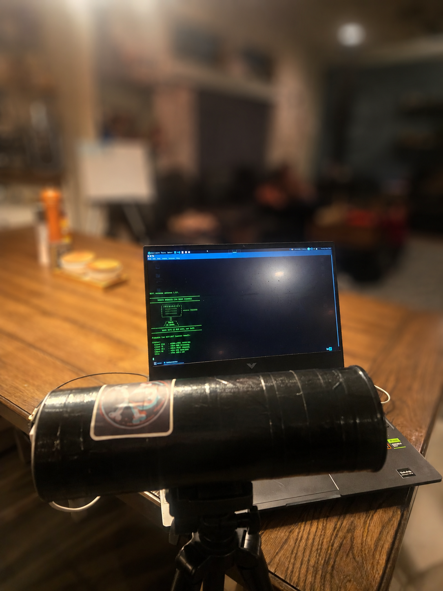

# CANTENNA

A simple ESP32 radio scanner built into a homemade can antenna.

CANTENNA scans nearby **WiFi networks** and **Bluetooth Low Energy (BLE) devices** and prints the results in the Serial Monitor.

---

## Photos


```md

```

---

## Inspiration

This build was inspired by a Pringles-can long-range WiFi antenna video:

[YouTube Reference Video](https://www.youtube.com/watch?v=Ym0BquPVfZw)

---

## Features

* WiFi scanning
* BLE scanning
* Shows RSSI signal strength
* Shows WiFi channel and encryption type
* Simple Serial Monitor commands
* Homemade cantenna-style build

---

## Parts Needed

Based on the antenna build video:

* Empty Pringles can
* Copper wire
* USB WiFi adapter or ESP32 board
* USB cable
* Tape or hot glue
* Ruler
* Marker
* Scissors or knife
* Tripod or stand

For this version, I used an ESP32 board instead of a normal USB WiFi adapter.

---

## Software

* Arduino IDE
* ESP32 board package
* `NimBLE-Arduino` library by h2zero

Serial Monitor settings:

```text
Baud: 115200
Line ending: Newline
```

---

## Commands

After uploading the code, open the Serial Monitor and use:

```text
start wifi   - start WiFi scanning
stop wifi    - stop WiFi scanning
start ble    - start BLE scanning
stop ble     - stop BLE scanning
help         - show commands
```

WiFi and BLE scanning do not run at the same time. Stop one before starting the other.

---

## Example Output

```text
[WiFi] Networks found: 3

#    RSSI   CH   ENC        SSID
1    -42    6    WPA2       HomeNetwork
2    -70    11   WPA2/WPA3  Router_2
3    -82    1    OPEN       Guest
```

```text
[BLE] Devices found: 2

#    RSSI   ADDRESS              NAME
1    -55    aa:bb:cc:dd:ee:ff    BLE_Device
2    -73    11:22:33:44:55:66    (no name)
```

---

## Notes

Move or rotate the can while watching the RSSI values. A signal closer to `0` is stronger.

Example:

```text
-40 dBm = strong
-70 dBm = weak
-90 dBm = very weak
```

---

## Disclaimer

This project is for learning and personal testing only. Only scan networks and devices you are allowed to test.
